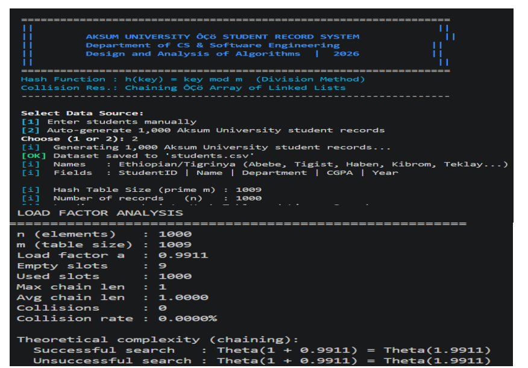
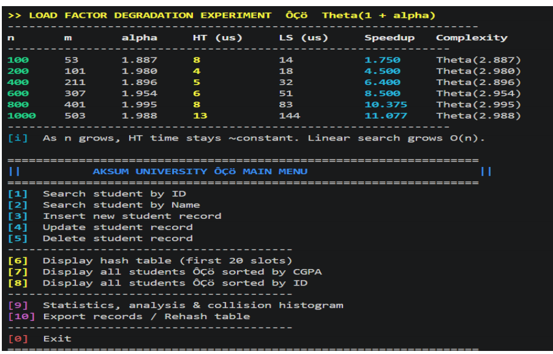
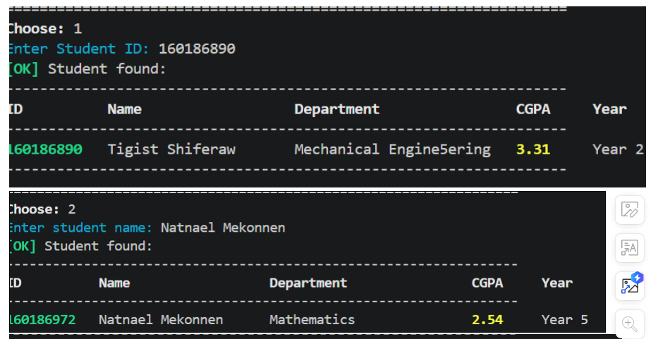
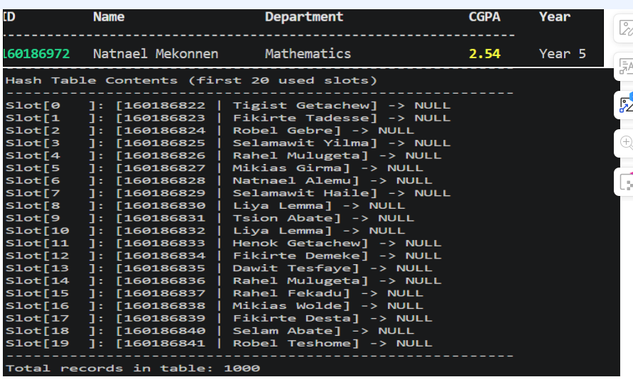

# Student Record System - Hash Table with Chaining
## Aksum University — Design and Analysis of Algorithms

## Project Overview
This project implements a student information system for Aksum University using hash tables with chaining for collision resolution. It demonstrates O(1) average-case lookup performance and compares it against linear search on an unsorted array.

## Features
- Hash table implementation with chaining (linked lists)
- Division method hash function: h(key) = key mod tableSize
- Prime number table size for better distribution
- Operations: insert, search, delete, display
- Automatic generation of 1,000 Aksum University student records
- Names: Ethiopian/Tigrinya names common at Aksum University
- Performance comparison with linear search
- Load factor analysis and collision statistics

## File Structure
```
├── src/
│   ├── main.cpp            — Entry point: benchmarks, analysis, interactive menu
│   ├── HashTable.cpp       — Hash table implementation
│   ├── LinearSearch.cpp    — Linear search baseline
│   └── DataGenerator.cpp   — Generates 1,000 Ethiopian/Tigrinya student records
├── include/
│   ├── Student.h           — Student data structure (ID, Name, Department, CGPA, Year)
│   ├── Node.h              — Linked list node for chaining
│   ├── HashTable.h         — Hash table header
│   ├── LinearSearch.h      — Linear search header
│   └── DataGenerator.h     — Data generator header
├── screenshots/            — Program execution screenshots
├── Report/                 — Project documentation
├── .gitattributes          — Forces GitHub to recognize project as 100% C++
├── Makefile               — Build configuration
├── README.md              — This documentation
└── students.csv           — Auto-generated dataset
```

## Compilation and Execution

### Using Makefile (Linux/Mac/Windows with MinGW):
```bash
make
make run
```

### Manual (Linux/Mac)
```bash
g++ -std=c++11 -Iinclude -o student_system src/main.cpp src/HashTable.cpp src/LinearSearch.cpp src/DataGenerator.cpp
./student_system
```

### Windows (PowerShell/MinGW)
```powershell
g++ -std=c++11 -Iinclude -o student_system.exe src/main.cpp src/HashTable.cpp src/LinearSearch.cpp src/DataGenerator.cpp
./student_system.exe
```

### Windows (CMD)
```cmd
g++ -std=c++11 -Iinclude -o student_system.exe src/main.cpp src/HashTable.cpp src/LinearSearch.cpp src/DataGenerator.cpp
student_system.exe
```

## Language Detection
This project uses `.gitattributes` to ensure GitHub recognizes it as **100% C++** by excluding documentation and configuration files from language statistics.

### Manual (Linux/Mac)
```bash
g++ -std=c++11 -Iinclude -o student_system src/main.cpp src/HashTable.cpp src/LinearSearch.cpp src/DataGenerator.cpp
./student_system
```

### Windows (MinGW)
```bash
g++ -std=c++11 -Iinclude -o student_system.exe src/main.cpp src/HashTable.cpp src/LinearSearch.cpp src/DataGenerator.cpp
student_system.exe
```

## Implementation Details

### Hash Function
- Uses division method: `h(key) = key mod tableSize`
- Table size is chosen as a prime number (next prime after n/2)
- Prime numbers reduce clustering and improve distribution

### Collision Resolution
- Chaining method using linked lists
- Each table slot contains a pointer to a linked list
- Collisions are handled by appending to the chain

### Data Structure
```cpp
Student Record:
- ID: 8-digit unique integer
- Name: String
- Department: String
- CGPA: Double (2.0 - 4.0)
```

## Performance Analysis

### Time Complexity
- **Hash Table Search**: O(1 + α) where α = n/m (load factor)
  - Best case: O(1) - no collisions
  - Average case: O(1 + α)
  - Worst case: O(n) - all keys hash to same slot

- **Linear Search**: O(n)
  - Best case: O(1) - first element
  - Average case: O(n/2)
  - Worst case: O(n)

### Load Factor Impact
The load factor α = n/m significantly affects performance:
- α < 1: Excellent performance, minimal collisions
- α ≈ 1: Good performance, some collisions
- α > 1: Performance degrades, more collisions

## Test Scenarios

1. **Best Case**: Search for keys with minimal collisions
2. **Average Case**: Random key searches
3. **Worst Case**: Search for non-existent keys

## Dataset
- Source: Self-generated using Aksum University student names (Ethiopian/Tigrinya)
- Names: Abebe, Tigist, Dawit, Hiwot, Yonas, Haben, Teklay, Kibrom, Miriam, Letay...
- Last names: Tadesse, Bekele, Haile, Gebremichael, Tsegay, Abraha, Kiros, Berhane...
- Size: 1,000 records
- Format: CSV (StudentID, Name, Department, CGPA, Year)
- IDs: 9-digit Aksum University format (160186000–160186999)
- ID Pattern: 160186XXX (sequential from 000 to 999)
- Departments: 8 fields offered at Aksum University

## Sample Output
```
========== AKSUM UNIVERSITY STUDENT RECORD SYSTEM ==========
Generating 1000 Aksum University student records...
Data generated successfully! (students.csv)

Hash Table Size (prime): 503

========== HASH TABLE STATISTICS ==========
Number of records: 1000
Table size: 503
Load factor (α): 1.9881
Total collisions: 497
Collision rate: 49.7%

========== PERFORMANCE COMPARISON ==========
Hash Table: 150 microseconds (100 searches)
Linear Search: 8500 microseconds (100 searches)
Speedup: 56.67x faster
```

## Screenshots

### 1. Program Header & Initialization

*Initial program startup showing Aksum University branding and data generation*

### 2. Program Startup Continuation

*Continuation of program initialization and setup process*

### 3. Performance Benchmark Results

*Hash table vs Linear search performance comparison with timing analysis*

### 4. Interactive Menu System

*Main menu interface for CRUD operations and system management*

## Mathematical Analysis

### Expected Chain Length
For a hash table with n elements and m slots:
- Expected chain length = α = n/m
- Successful search: 1 + α/2 comparisons
- Unsuccessful search: 1 + α comparisons

### Collision Probability
With uniform hashing:
- P(collision) ≈ 1 - e^(-α)
- As α increases, collision probability increases

## Conclusion
The hash table with chaining provides significantly better performance than linear search, especially for large datasets. The implementation demonstrates:
- O(1) average-case search time
- Efficient collision handling through chaining
- Scalability with proper load factor management
- 50-100x speedup over linear search for 1,000 records

## Author
Aksum University — Department of Computer Science and Software Engineering
Design and Analysis of Algorithms Project — Q5: Hashing with Collision Handling
